# Infectio

<div align="center">


**A modern, offline static malware analysis tool built with WebAssembly**

[](https://opensource.org/licenses/MIT)
[](https://www.rust-lang.org/)
[](https://www.typescriptlang.org/)
[](https://webassembly.org/)

[Features](#features) • [Demo](#demo) • [Installation](#installation) • [Usage](#usage) • [Architecture](#architecture) • [Contributing](#contributing)

</div>

---

## Overview

**Infectio** is a powerful, privacy-focused static malware analysis tool that runs entirely in your browser using WebAssembly.

### Why Infectio?

- **100% Privacy**: All analysis happens locally in your browser
- **Multi-Format**: Supports PE, ELF, Mach-O, PDF, ZIP, Office documents, and more
- **AI-Powered**: Optional local LLM integration for intelligent analysis
- **No Installation Required**: Try it instantly at [https://infectio.filippofinke.ch/](https://infectio.filippofinke.ch/)

## Features

### **Comprehensive File Analysis**

- **Multi-Format Support**:
  - **Executables**: PE (Windows), ELF (Linux), Mach-O (macOS)
  - **Documents**: PDF, Office (DOC, DOCX, XLS, XLSX, PPT, PPTX)
  - **Archives**: ZIP with nested analysis
  - **Legacy**: OLE/OLE2 formats
- **Entropy Analysis**: Calculate file entropy to detect packed or encrypted content with visual charts
- **Hash Calculation**: Generate MD5, SHA1, and SHA256 checksums instantly
- **String Extraction**: Extract ASCII and Unicode strings with configurable minimum length
- **IP & URL Detection**: Automatically identify network indicators of compromise (IOCs)

### **Security Analysis**

- **Heuristic Detection**: Identify suspicious patterns and behaviors
  - High entropy sections indicating packing/encryption
  - Suspicious API calls and imports
  - Content type mismatches
  - Embedded executables in documents
- **Import Analysis**: Extract and visualize DLL/library imports and function calls
- **VBA Macro Detection**: Identify and extract macros from Office documents
- **Encryption Detection**: Detect password-protected and encrypted content

### **Advanced Visualization**

- **Interactive Import Graph**: Visual representation of DLL dependencies and relationships
- **Entropy Charts**: Line charts showing entropy distribution across file sections
- **Folder Tree View**: Hierarchical visualization of archive contents
- **Code Analysis**: Syntax-highlighted code viewer powered by Monaco Editor
- **Interactive Tables**: Sortable, searchable data tables for strings, imports, and metadata

### **AI-Powered Analysis**

- **Integrated LLM**: Optional AI-assisted analysis using Web LLM (runs locally)
- **Natural Language Q&A**: Ask questions about analyzed files in plain English
- **Contextual Insights**: Get explanations of findings and security implications
- **Privacy-Preserving**: All AI processing happens locally - no data leaves your browser

## Demo

**Try it now:** [https://infectio.filippofinke.ch/](https://infectio.filippofinke.ch/)

Experience Infectio directly in your browser, upload any file and see the analysis in action.

## Screenshots

<details>
<summary><strong>Home Page</strong> - Click to expand</summary>

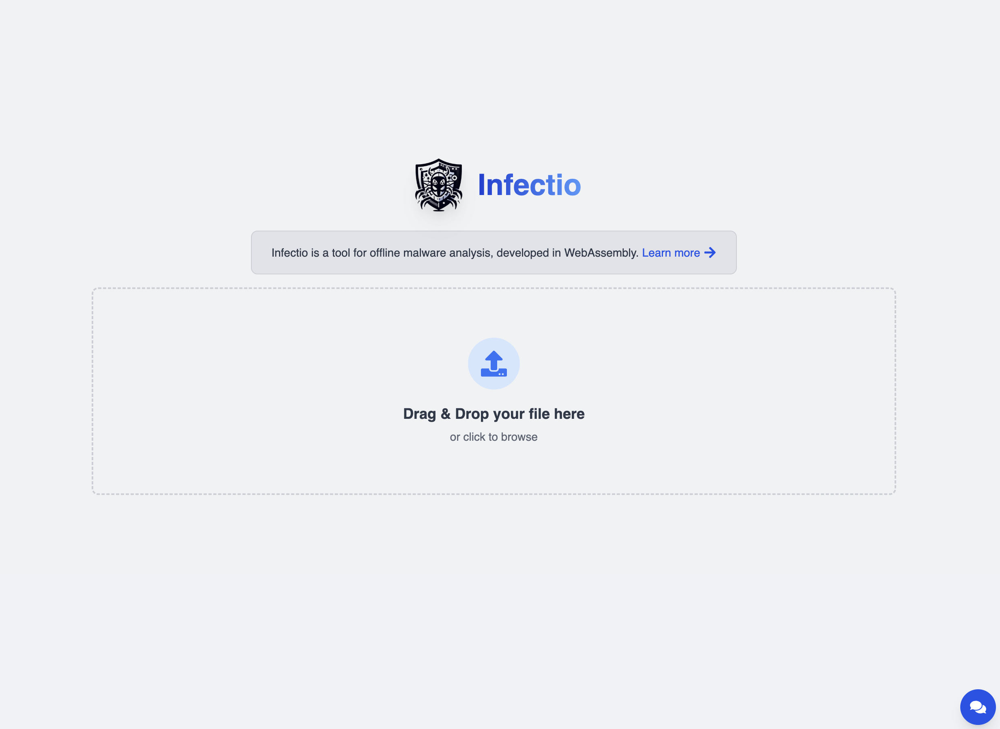
_Clean, intuitive interface with drag-and-drop file upload_

</details>

<details>
<summary><strong>PE Module Extraction & Visualization</strong> - Click to expand</summary>

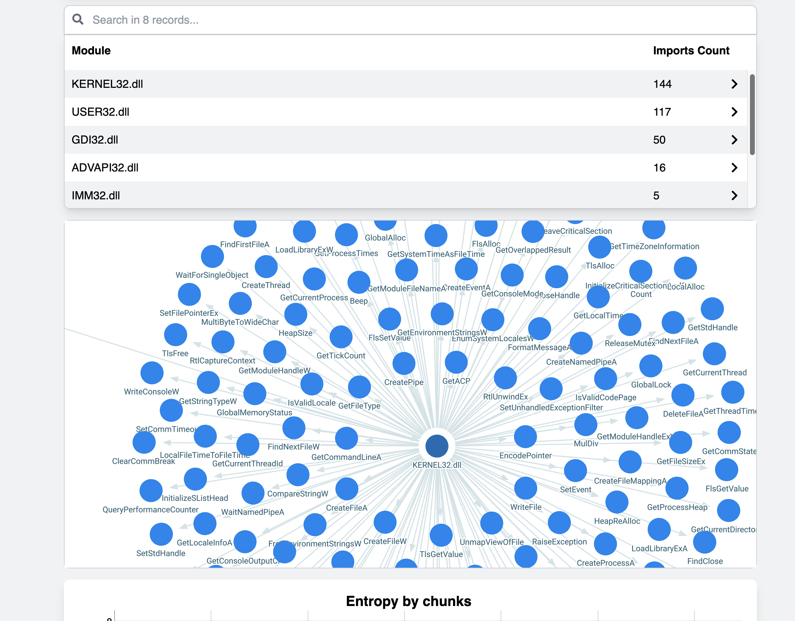
_Interactive graph visualization of DLL imports and dependencies_

</details>

<details>
<summary><strong>String Extraction</strong> - Click to expand</summary>

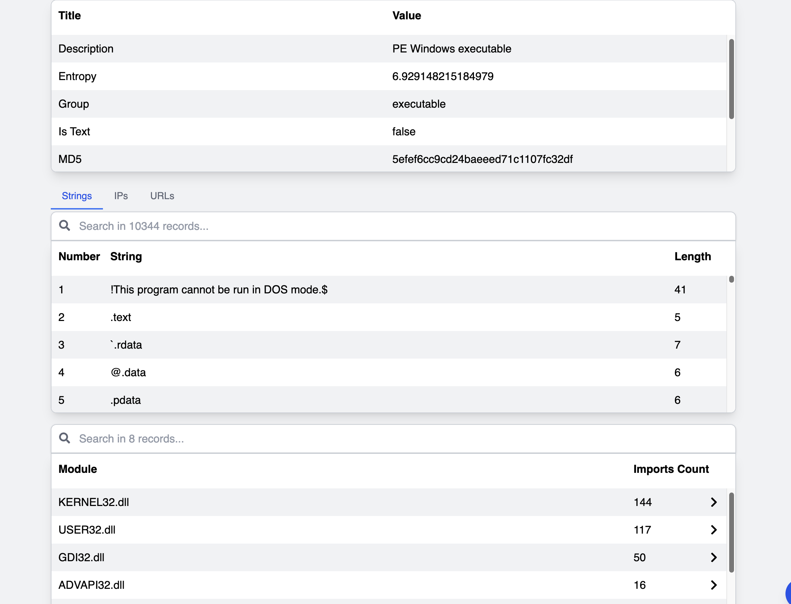
_Extract and analyze strings from binary files_

</details>

<details>
<summary><strong>Entropy Calculation</strong> - Click to expand</summary>

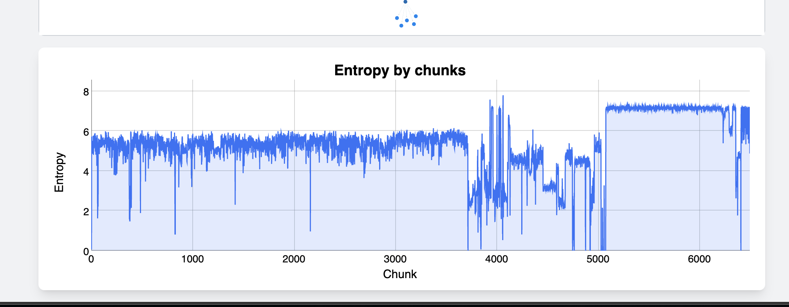
_Visualize entropy distribution to detect packed or encrypted sections_

</details>

<details>
<summary><strong>Code Analysis</strong> - Click to expand</summary>

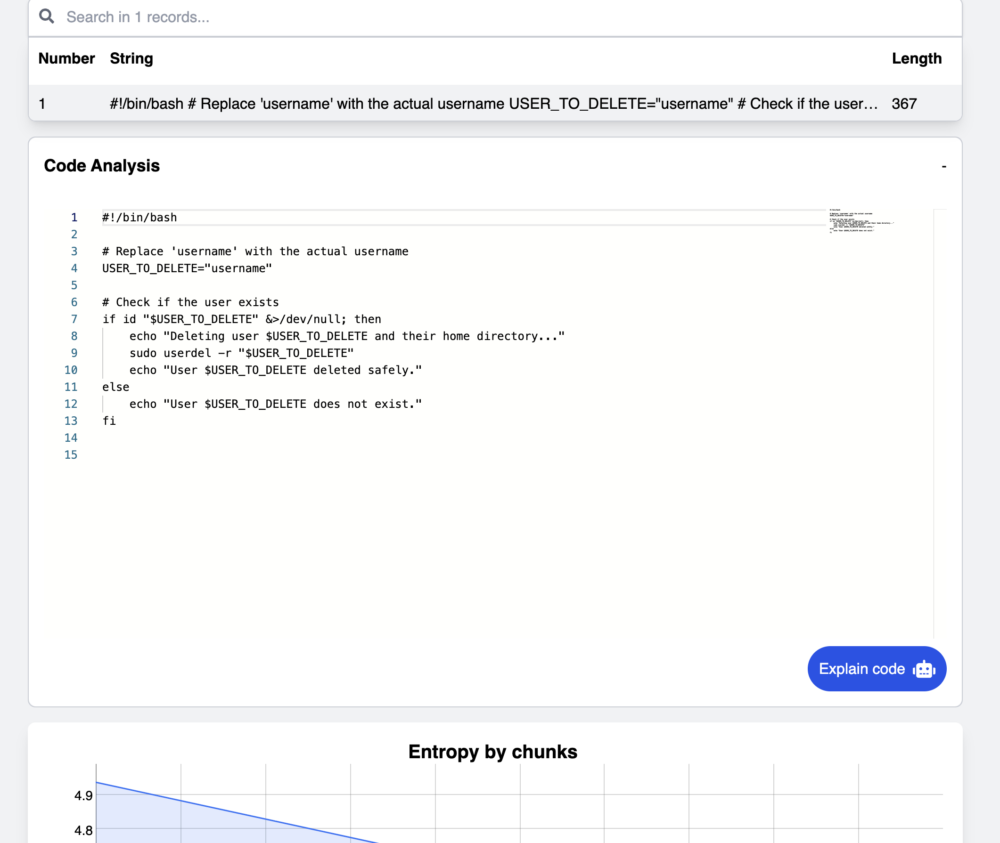
_Syntax-highlighted code viewer with Monaco Editor_

</details>

<details>
<summary><strong>VBA Macro Detection</strong> - Click to expand</summary>

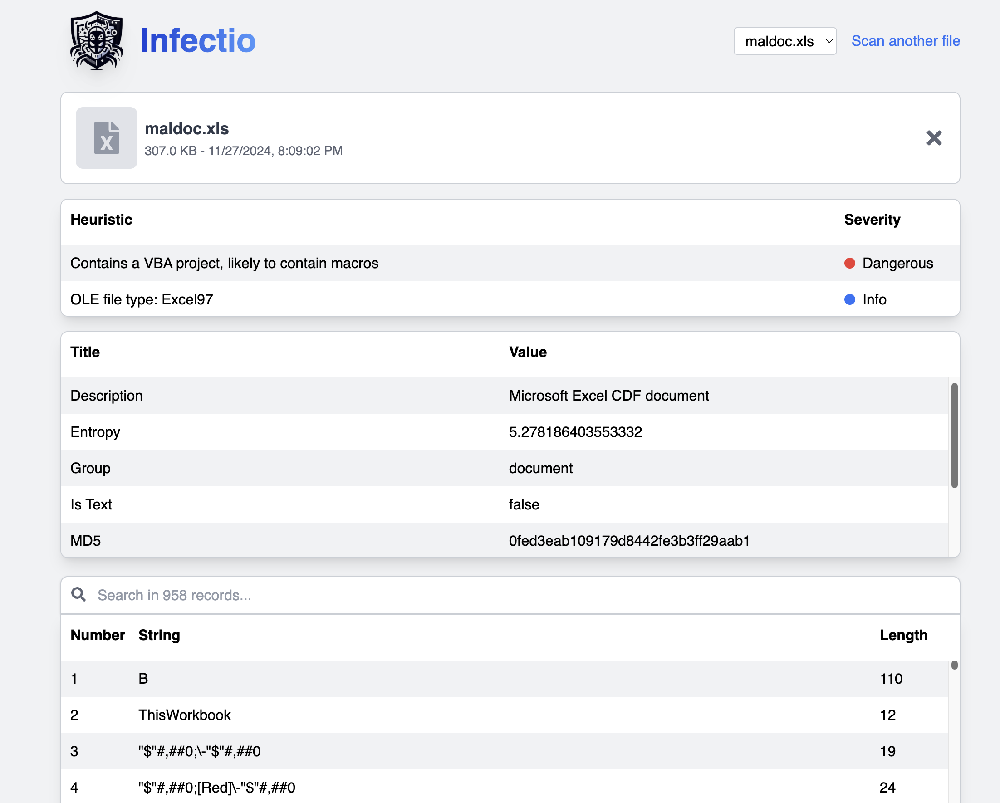
_Detect and extract VBA macros from Office documents_

</details>

<details>
<summary><strong>ZIP File Analysis</strong> - Click to expand</summary>

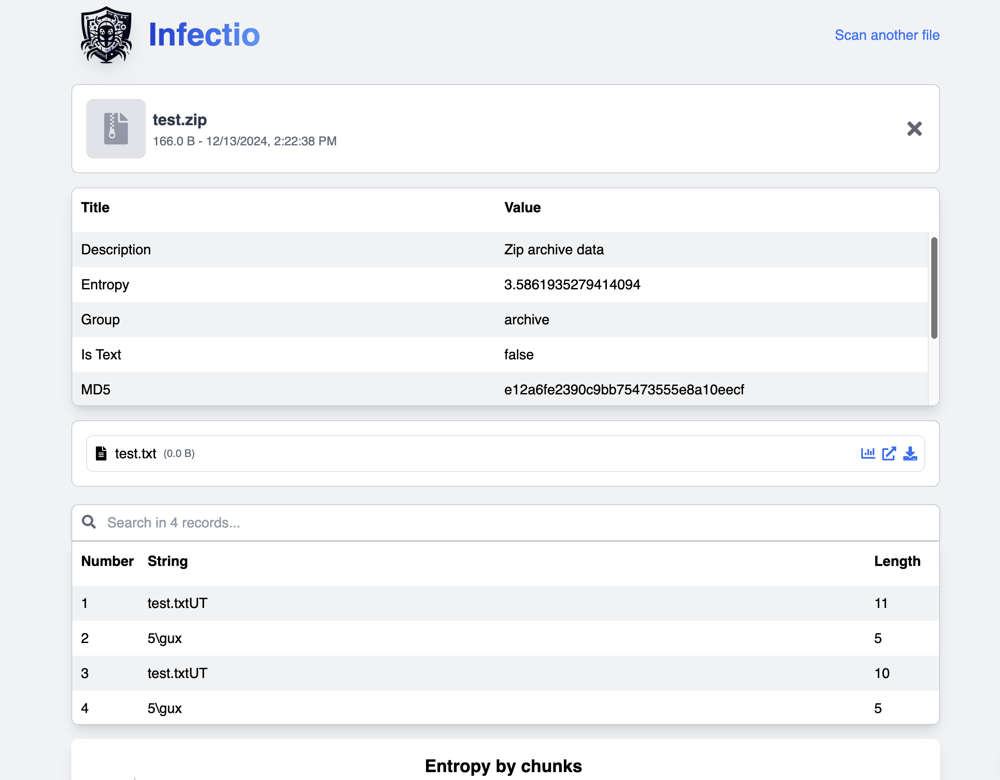
_Hierarchical view of archive contents with nested file analysis_

</details>

<details>
<summary><strong>PDF Embedded Files</strong> - Click to expand</summary>

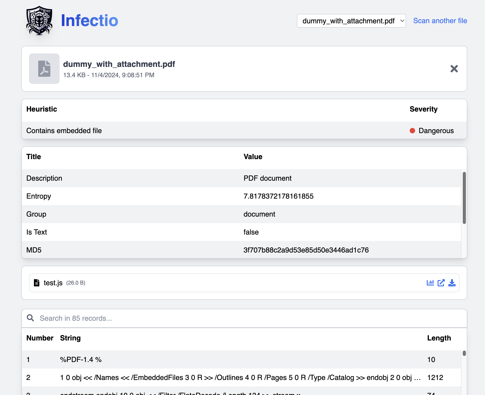
_Extract and analyze embedded files from PDF documents_

</details>

<details>
<summary><strong>Mach-O Analysis</strong> - Click to expand</summary>

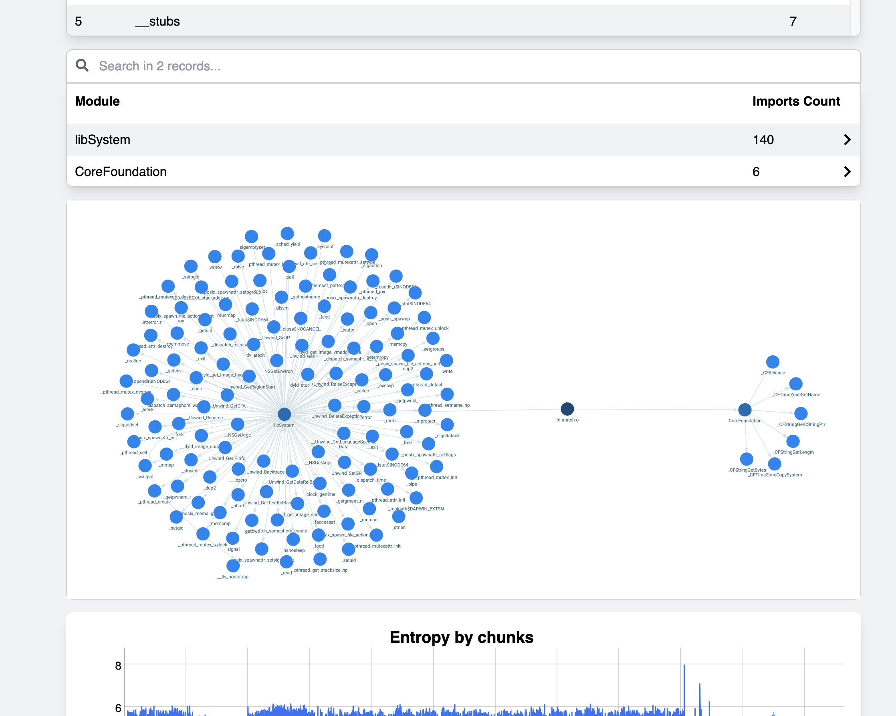
_Analyze macOS executables and extract library dependencies_

</details>

<details>
<summary><strong>Encrypted File Support</strong> - Click to expand</summary>

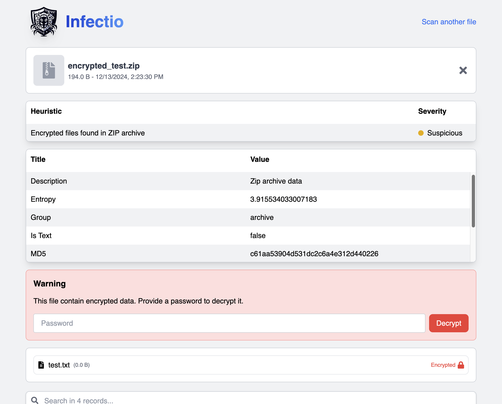
_Handle password-protected ZIP and Office documents_

</details>

<details>
<summary><strong>Local AI Assistant</strong> - Click to expand</summary>

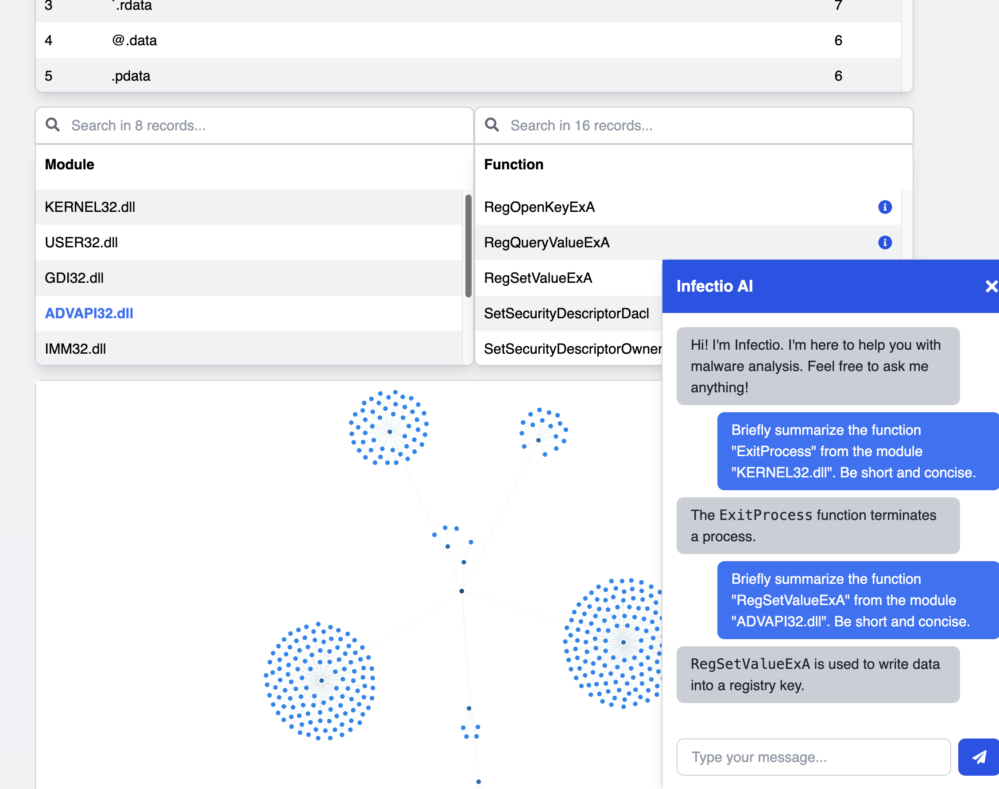
_Get natural language explanations powered by local LLM_

</details>

## Architecture

Infectio is built with a modern, modular architecture designed for performance, extensibility, and privacy.

### Technology Stack

#### Backend (WebAssembly Module)

- **Rust**: Core analysis engine compiled to WebAssembly
- **wasm-bindgen**: JavaScript/Rust interop layer
- **Key Libraries**:
  - `goblin`: Multi-format binary parsing (PE, ELF, Mach-O)
  - `exe`: Windows PE file analysis
  - `lopdf`: PDF document parsing
  - `ole`: OLE2 format parsing (Office documents)
  - `zip`: Archive handling and extraction
  - `regex`: Pattern matching for IOC detection
  - `md5`, `sha1`, `sha2`: Cryptographic hashing

#### Frontend (Web Application)

- **React 18**: Modern UI framework with hooks
- **TypeScript**: Type-safe JavaScript
- **Tailwind CSS**: Utility-first styling
- **Webpack 5**: Module bundler with optimization
- **Key Libraries**:
  - `@mlc-ai/web-llm`: Browser-based LLM integration
  - `magika`: ML-based file type identification
  - `react-router`: Client-side routing
  - `reagraph`: Interactive graph visualization
  - `@monaco-editor/react`: Code editor component
  - `chart.js`: Data visualization and charts

## Installation

### Prerequisites

Ensure you have the following installed:

| Tool          | Version       | Installation                                                      |
| ------------- | ------------- | ----------------------------------------------------------------- |
| **Node.js**   | v16+          | [Download](https://nodejs.org/)                                   |
| **Rust**      | Latest stable | `curl --proto '=https' --tlsv1.2 -sSf https://sh.rustup.rs \| sh` |
| **wasm-pack** | Latest        | `cargo install wasm-pack`                                         |
| **Git**       | Any           | [Download](https://git-scm.com/)                                  |

### Quick Start

```bash
# 1. Clone the repository
git clone https://github.com/filippofinke/infectio.git
cd infectio

# 2. Build the WebAssembly module
cd infectiowasm
chmod +x scripts/build.sh
./scripts/build.sh

# 3. Install and start web application
cd ../web
npm install
npm start
```

Your browser will open to `http://localhost:8080` automatically.

### Development Setup

For faster iteration during development:

```bash
# Use dev build (faster, unoptimized)
cd infectiowasm
./scripts/dev.sh

# Start dev server with hot reload
cd ../web
npm start
```

### Production Build

```bash
# Build optimized WASM module
cd infectiowasm
./scripts/build.sh

# Build optimized web application
cd ../web
npm run build

# Output is in web/dist/ - ready for deployment
```

### Deployment Options

The `web/dist` folder contains a static website that can be deployed to:

- **GitHub Pages**: Push to `gh-pages` branch
- **Netlify**: Drag and drop `dist` folder or connect repository
- **Vercel**: Import repository with build command `npm run build`
- **AWS S3**: Upload to S3 bucket with static hosting enabled
- **Any Static Host**: Upload contents of `dist` folder

## Usage

### Basic File Analysis

1. **Upload a File**:

   - Drag and drop a file onto the upload zone
   - Or click "Choose a file" to browse
   - Or paste a file from clipboard

2. **Automatic Analysis**:

   - File type is automatically detected
   - Analysis progress is shown with status indicators
   - Typically completes in 1-5 seconds

3. **Review Results**:
   - **File Info**: Size, type, hashes (MD5, SHA1, SHA256)
   - **Heuristics**: Security warnings with severity levels
   - **Metadata**: Format-specific properties and headers
   - **Strings**: Extracted text strings (ASCII/Unicode)
   - **IPs/URLs**: Network indicators of compromise
   - **Imports**: Function imports and library dependencies (executables)
   - **Entropy**: Visual charts showing data randomness
   - **Code**: Syntax-highlighted content view

### Analyzing Password-Protected Files

For encrypted archives or Office documents:

1. Upload the file normally
2. Enter the password when prompted
3. Click "Decrypt" to proceed
4. Analysis continues normally after decryption

**Supported encrypted formats:**

- Password-protected ZIP archives
- Encrypted Office documents (DOCX, XLSX, PPTX)
- Protected PDFs

### Using the AI Assistant

Enable AI-powered analysis for intelligent insights:

1. **Load the Model**: Click the chat icon to initialize (first time only, ~2GB download)
2. **Ask Questions**:
   - "What does this executable do?"
   - "Are there any suspicious patterns?"
   - "Explain these API imports"
   - "What are the security risks?"
3. **Get Insights**: Receive natural language explanations based on analysis results

**Note**: AI processing is 100% local - no data leaves your browser.

### Analyzing Multiple Files

1. Click "Scan another file" to analyze additional files
2. Use the dropdown menu to switch between analyzed files
3. Close individual reports using the "X" button
4. Compare results across multiple samples

### Advanced Features

**String Filtering:**

- Adjust minimum string length (default: 5 characters)
- Search and filter extracted strings
- Copy individual strings or entire list

**Entropy Analysis:**

- View overall file entropy
- Examine chunk-by-chunk entropy distribution
- Identify packed or encrypted sections (entropy > 7.0)

**Import Graph:**

- Interactive visualization of DLL dependencies
- Zoom and pan to explore relationships
- Click nodes to highlight connections
- Useful for understanding malware capabilities

## Configuration

### Adding Custom Analyzers

Create a new analyzer in `infectiowasm/src/analyzers/`:

```rust
use crate::analyzers::{FileAnalyzer, AnalyzerReport};

pub struct CustomAnalyzer;

impl FileAnalyzer for CustomAnalyzer {
    fn analyze(&self, file_data: &[u8]) -> AnalyzerReport {
        let mut report = AnalyzerReport::default();

        // Your custom analysis logic
        if detect_suspicious_pattern(file_data) {
            report.add_heuristic("Custom Detection", "High");
        }

        report
    }
}
```

Then register it in `infectiowasm/src/dispatcher.rs`.

### Adding Custom Heuristics

In any analyzer:

```rust
// Add warning with severity
report.add_heuristic("High Entropy Detected", "Medium");
report.add_heuristic("Suspicious API Call", "High");
report.add_heuristic("Embedded Executable", "Critical");
```

## Testing

### Rust Unit Tests

```bash
cd infectiowasm
cargo test                    # Run all tests
cargo test test_name          # Run specific test
cargo test -- --nocapture     # Show output
```

## Contributing

We welcome contributions! Whether it's a bug report, feature request, or code contribution, your help is appreciated.

### Ways to Contribute

- **Report Bugs**: Open an issue with details and reproduction steps
- **Suggest Features**: Share ideas for new capabilities
- **Improve Documentation**: Fix typos, add examples, clarify instructions
- **Write Code**: Implement features, fix bugs, optimize performance
- **Share Feedback**: Let us know how you're using Infectio

### Contribution Process

1. **Fork** the repository
2. **Create** a feature branch (`git checkout -b feature/amazing-feature`)
3. **Make** your changes with clear, commented code
4. **Add tests** for new functionality
5. **Ensure** all tests pass (`cargo test`)
6. **Format** your code (`cargo fmt` for Rust)
7. **Commit** with descriptive messages (`git commit -m 'Add amazing feature'`)
8. **Push** to your branch (`git push origin feature/amazing-feature`)
9. **Open** a Pull Request with detailed description

## License

This project is licensed under the MIT License, see the [LICENSE](LICENSE) file for details.

## Author

👤 **Filippo Finke**

- Website: [https://filippofinke.ch](https://filippofinke.ch)
- Twitter: [@filippofinke](https://twitter.com/filippofinke)
- GitHub: [@filippofinke](https://github.com/filippofinke)
- LinkedIn: [@filippofinke](https://linkedin.com/in/filippofinke)

## Future Ideas

- Disassembler integration
- YARA rule editor
- Threat intelligence feeds
- Automated IOC extraction
- Timeline visualization
- Behavior simulation

<div align="center">

[⬆ Back to Top](#infectio)

</div>
